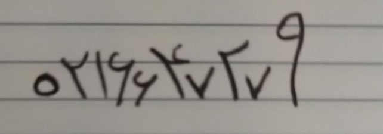
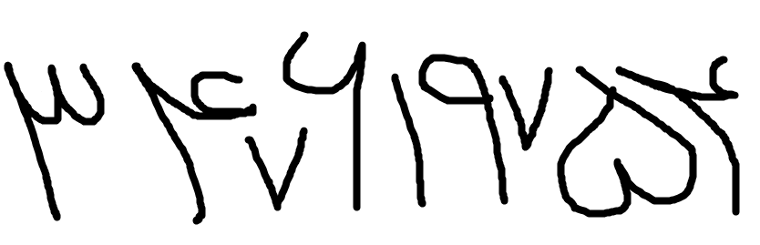

# Complex-handwritten-Persian_Arabic-Digits
Hi

It is a Pure CNN model ( Not RCNN,FRCNN,YOLO or anything else ) which can detect complex persian/Arabic handwritten Numbers . 

It is in jupyter niotebook format so do not forget to run all the blocks from the begining to the end . 

There are also 3 persian handwritten images in this repository and as you can see 2 of them are complex and the application easily understands and identify them .

Here is one of that complex handwritten images :

Or this one :

Feel free to fork this repository but pls mention me . 

Good Luck 

Dr Mehdi Sobhani
